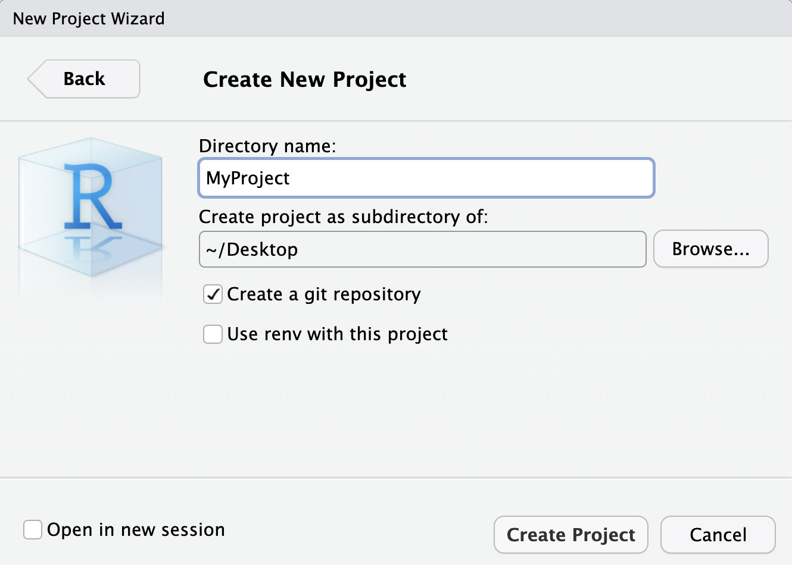
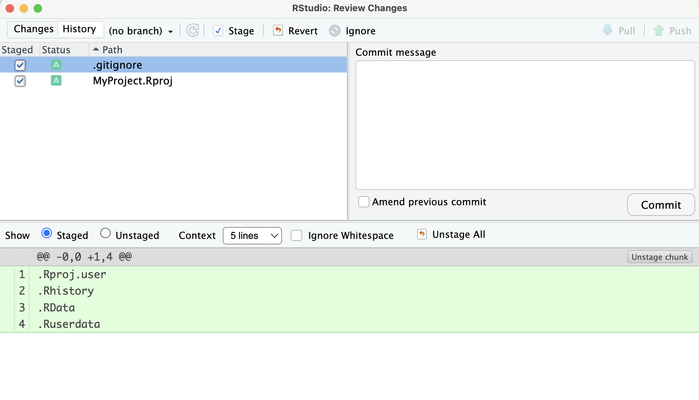
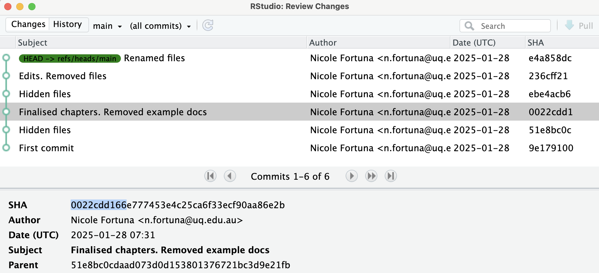
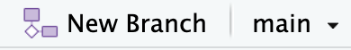

# Tracking code with Git

## Creating a local repository
A git repository is a set of files associated with a particular project that are tracked together. To track a set of files, git needs to be initiated within the topmost level of a folder containing the work in question. Every file at and within the file hierarchy that git is initiated in will be tracked by git. If you are writing code in R, it is best to organise your code in an RStudio project, and then use RStudio to initiate your repository and track your progress.

An R package that is useful for automating a lot of the functions of git is `usethis`. This package is also useful if you ever want to write your own R package. 
```{r, eval=FALSE}
install.packages("usethis")
library(usethis)
```

### Initiating a repository for existing code
If you have Git installed on your computer, you can turn an existing project into a git repository by executing the following line in the of your project:

```{r, eval=FALSE}
use_git()
```

The function will prompt you to make a first commit. Agree.

Alternatively, click **Tools** -> **Version Control** -> **Project Setup**, then click the dropdown box **Version control system** and select **Git**.

You should see a Git tab in the top right hand panel once Git is associated with a project. If you can't, select **View** -> **Show Git**. If it still does not appear, you may need to close and reopen RStudio.

### Initiating a new project with git 

In RStudio, click on **File** -> **New Project**, or the  button. A 'Create Project' window will pop up, and you should select **New Directory->New Project**. The following window will then open, allowing you to select a name for your package, as well as choose the directory in which the package will be stored. At this point, you can select if you would like to initiate this project with a Git repository. If you already have Git installed on your computer, I recommend that you check the **Create a git repository** box before you select **Create Project**.

<center></center>

A new RStudio window will open containing your new project. In your project window, you will see that a number of files have been automatically generated. These are your project file, and .gitignore file. We will talk about .gitigore later on. You should see these files listed in the Git tab in the top right hand panel. Now would be a good time to make your first commit. Go to the [**How to use git to track your package over time**](## how-to-use-git-to-track-your-package-over-time) section for instructions on how to do this.

## Hiding files from git
Within a project there are often a number of invisible files that are created automatically by the tools being used. For example, R will often generate a .Rhistory file that is of no benefit to you to track. In this case it is advisable to hide these files from git in order to prevent them from being unnecessarily tracked. Files are hidden from Git by placing them in a .gitignore file within the same directory that you initiated git.

For files/folders listed in .gitignore, the path directory of the files should be relative to the directory of the .gitignore file. You can edit the file by opening it in RStudio. Both methods for initiating a git repositories that were listed above should have automatically populated your .gitignore file with commonly hidden files.

If you have previously committed a file and want to stop tracking the file without deleting the file from your local working directory, in addition to listing the file in .gitignore, run the following line in either Terminal or Git Bash:
```{bash eval = FALSE}
git rm --cached <.Rhistory>
```

If you want to hide but not delete a folder, you will need to include the argument `-r`:
```{bash eval = FALSE}
git rm --cached -r <.Rproj.user/**>
```

In the above command `/**` indicates that you want to indicate every file contained within the .Rproj.user folder.

## Tracking project changes
Git keeps track of different versions of a project by taking 'snapshots' of the project at times specified by the user. Versions of a project should ideally be tracked (committed) at the completion of some new feature. Eg: once you have finished reformatting a file, have finished updating a function, or have completed an initial working version of some new function. This will prevent confusion if you ever need to revert to a previous version of a file.

A tracked file can exist in three stages according to Git. If a file matches the most recently committed version of the file in Git, it is considered Unmodified. If the file is edited in any way, it becomes Modified. When a Modified file is at an appropriate stage to be tracked by Git, it can be marked as a Staged file. Once a Staged file has been committed, this file returns to an Unmodified status.

Figure 2 demonstrates the different states that can exist within a git repository. The git 'database' contains a record of all the commits that have occurred up to date. The working directory is where you as a user do work. You can modify the files in the repository, and while git can recognise that the files in your directory may not match the most recent commit, git cannot add new changes unless you stage them first. By staging files that have been changed, you indicate which changes to be included in the new snapshot that will be added to the database. Figure 2 also indicates some example Terminal commands that can be used to transition between different states.


As stated previously, a Git repository can easily be initiated by running `use_git()`, including performing your first commit. You can also specify that you want to initiate your RStudio project with a Git repository. If you do it this way however, you will need to create your first commit yourself.

In the top right panel, you should see a **Git** tab, if you click on it you will be given a number of tools that will allow you to interact with Git. Along the top of this tab are a number of buttons that replace the most common Git terminal commands. This tab will also list any files that do not match the previous commit. This could be because the file was modified, or because the file has been created or deleted since the last commit. These types of files will appear as shown below. 

<center></center>

Newly added files will have a yellow question mark under the Status column, while a modified file will have a blue M listed to the right hand side of the column. It can be seen that under the Staged column, neither of the boxes have been ticked off. This means that neither of these files have been staged to be committed. In order to stage files, the user simply needs to tick the boxes listed in the staged column. As shown below.

<center></center>

Once these files have been staged, their status will change. New files will be indicated with a green A, while the blue M for modified files will now be listed to the left. To commit the selected files, select the **Commit** button. This will open up a window that will give the opportunity to provide a commit message. Provide a meaningful description of the changes that you have made, then select **Commit**.

If you would like to see the differences in the listed files when compared to the most recent commit, you can select the **Diff** button. This will open up the same window which will also allow the user to explore the differences for each affected file.

<center></center>

## Recovering old versions of your repository
Git keeps a record of every committed version of a project. Each commit contains the version of each file at the time of the commit, the description of the committed version provided by the user at the time of the commit, as well as a unique ID number generated at the time of the commit. If the commit log is viewed, all previous commits made by users will be listed in reverse chronological order. To view this log of the previous commits, you can select the **History** button in the Git tab (looks like a clock).

There are many reasons as to why you may want to revert to a previous version of a file. It could be that the current solution that has been built is not viable, so you want to return to the time before your current fix in order to go in a different direction. It could also be that the current version of the project is broken in some way, and so you want to go back to a functioning version of the code. Regardless of the reason, this is a step that should be taken with caution, because once you have reverted to a previous version of the code, you will lose all the subsequent work that you have done. This risk can be mitigated through the use of branches, which we will discuss later.

Unfortunately, to go back in time you will need to interact with Terminal (or Git Bash). If you are using a Mac, you should be able to open a Terminal window as part of your RStudio project, just select **Tools** -> **Terminal**, or use that short cut **Shift+Alt+T**. If you are using Windows, you will need to open a Git Bash session and make sure that you are in the correct working directory. This can be done by typing the command `cd` (change directory), and then dragging and dropping the folder into the Git Bash window (this will generate the file path).

If you want to revert to the most recent commit (and loose the most recent modifications that you have made), you can run:
```{bash eval = FALSE}
git reset
```

If you would like to go further back in time in your project, you will need to refer to the exact snapshot that you want to return to. If you select the **History** button, a window will open showing all of your past commits.

<center></center>

If you select the commit you would like to return to, you will see a series of letters and numbers refered to as SHA. This is the equivalent of a commit ID. For example, the first few symbols of the version you want to revert to might be 0022cdd166. In which case you would run:

```{bash eval = FALSE}
git reset --hard <0022cdd166>
```

<b> NOTE: this is one of the few actions that cannot be reversed. If returning to a previous version, any more recent work will be permanently lost on that branch. TREAD CAREFULLY! </b>

## Creating and switching between branches
An amazing feature of git, is the ability to have multiple branches for a project. Different branches can be created if you need to debug a feature, create a new feature, etc. Once you are happy with your changes, branches can be merged back in to the master. The initial, automatic branch that is created when you initiate git, is called master. Any additional branches should be given a name that will indicate it's purpose. When you create a new branch, that new branch will have the entire history of the branch that you are currently working on. Therefore if you would like to revert to a previous version of a project, it is a good idea to first create another branch that will keep a record of your more recent commits as a backup. 

When dealing with branches the following section of the git panel will be relevant.


To create a new branch click on the **New Branch** button. This will open a new window that will allow you to name your new branch. Once you select **Create**, you will see that the **Main** drop down menu has now changed to your new branch. If you select the drop down menu, you will be able to switch between any branch that you have created. If switching between branches, make sure that you have committed any changes that you want to keep on the current branch.
 
## Merging branches
A consequence of having multiple branches with partially overlapping histories, is that if you want to merge two branches together, there may be conflicts in the code. The way that git merges files is by comparing the changes that have been made to the code in each of the two branches in comparison to the most recent shared commit history (the point in time when the new branch was created). 

To merge another branch into the branch on which you are currently working:
```{bash, eval = FALSE}
git merge <otherBranch>
```

If the changes in each branch have occurred in different files or lines in the code, then git will automatically incorporate those changes. If the same section of code has been modified on both branches, then git will require the user to manually merge the two files.

In the case that you are required to manually merge conflicts within a file, git will list the files that require merging. When you open said file, git will indicate all of the locations in the file that have been edited in both of the merged branches as shown in the example below:

``` {bash eval = FALSE }
merged code
<<<<<<<< HEAD 
version 1 of code
========= 
version 2 of code
>>>>>>>> a6dsjd95y 
merged code
```

At every point where you see the above, you will need to either choose which of the versions of code to keep, or find a way to incorporate aspects of both. In either case, you will need to manually change the file, including getting rid of the signposting generated by git. If you are using RStudio, you can directly open the file to edit it. Once you have made these changes, you will need to commit the new version of the file. The commit message should include which branches were merged and potentially how you resolved any conflicts.


