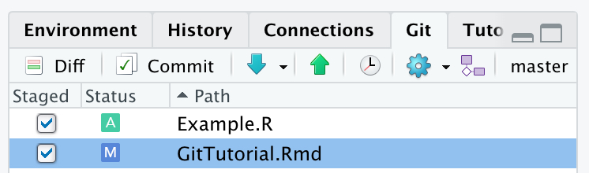

# Tracking code with Git

## Setting up a repository
### Creating a local repository
A git repository is a set of files associated with a particular project that are all tracked together. To track a set of files, git needs to be initiated within the topmost level of a file containing the work in question. Every file at and within the file hierarchy that git is initiated in will be tracked by git.

To initiate a repository on your local computer, navigate through the terminal to the location of your project and run the command:
```{bash eval = FALSE}
git init
```

This command will set up an invisible .git file within the specified directory. 

To view the .git file you can run the command:
```{bash eval = FALSE}
ls -a
```

Once you have initiated your git repository, it is time to take the first snapshot of your project. To take a snapshot, first the changes that you want to capture need to be staged. Staging a file makes it visible to git. Once git can see the files you are interested in, you can commit those changes to make the snapshot. In the case of your first commit, it is likely that you will want to capture all the files in the directory and therefore you can stage all of the available files. 

At any point, you can check the status of the files within git using the following command:
```{bash eval = FALSE}
git status
```

If you have just initiated a git repository on your local computer, if you run the ``` git status ``` command, you will see all the files within your repository highlighted in red. This is because these files are not yet tracked.

To stage all the files within the directory:
```{bash eval = FALSE}
git add -A
```

The ```-A``` in this instance is used to refer to all the files within the directory. If you only wanted to stage particular files, you could replace ```-A``` with the name of a particular file.

If you were to run the ``` git status ``` command at this point, all the files within the git repository will be listed again, but this time in green. This is because these files have all been staged, and are therefore ready for a snapshot to be taken. Only files that are highlighted green will be included in the snapshot.

To take the snapshot, the files need to be committed:
```{bash eval = FALSE}
git commit -m <"My first commit.">
```

In this command ```-m``` dictates that you want to write a message. The message you provide within quotation marks will be used to describe the snapshot that you have taken. The first commit message is generally something innocuous like ```"First commit."```. As you take more snapshots in the future, you should write a meaningful message that describes what is different about the code in comparison to the previous snapshot.

## Hiding files from git
Within a project there are often a number of invisible files that are created automatically by the tools being used. For example, R will often generate a .Rhistory file that is of no benefit to you to track. In this case it is advisable to hide these files from git in order to prevent them from being unnecessarily tracked. Files are hidden from Git by placing them in a .gitignore file within the same directory that you initiated git.

Within your project directory, you can create a .gitignore file with the command:
```{bash eval = FALSE}
touch .gitignore
```

This file will often be hidden, if this is that case you can view it with the command:
```{bash eval = FALSE}
ls -a
```

Within the .gitignore you can list the files that you do not want to track. The path directory of the files should be relative to the directory of the .gitignore file. You can edit the file using vim, or you can add to the file by opening it in RStudio.

To quickly list the files contained within .gitignore:
```{bash eval = FALSE}
cat .gitignore
```

If you have previously committed a file and want to stop tracking the file without deleting the file from your local working directory, in addition to listing the file in .gitignore, run:
```{bash eval = FALSE}
git rm --cached <.Rhistory>
```

If you want to hide but not delete a folder, you will need to include the argument `-r`:
```{bash eval = FALSE}
git rm --cached -r <.Rproj.user/**>
```

In the above command `/**` indicates that you want to include every file contained within the .Rproj.user folder.

## Tracking project changes
Git keeps track of different versions of a project by taking 'snapshots' of the project at times specified by the user. Versions of a project should only be tracked (committed) at the completion of some new feature. Eg: once you have finished reformatting a file, have finished updating a function, or have completed an initial working version of some new function. This will prevent confusion if you ever need to revert to a previous version of a file.
A tracked file can exist in three stages according to Git. If a file matches the most recently committed version of the file in Git, it is considered Unmodified. If the file is edited in any way, it becomes Modified. When a Modified file is at an appropriate stage to be tracked by Git, it can be marked as a Staged file. Once a Staged file has been committed, this file returns to an Unmodified status.

Figure 2 demonstrates the different states that can exist within a git repository. The git 'database' contains a record of all the commits that have occurred up to date. The working directory is where you as a user do work. You can modify the files in the repository, and while git can recognise that the files in you directory may not match the most recent commit that you have made, git cannot add new changes unless you stage them first. By staging files that have been changed, you indicate which changes to be included in the new snapshot that will be added to the git database. Figure 2 also indicates some example commands that can be used to transition between different states.


In order to check the status of files in a project tracked by Git:
```{bash eval = FALSE}
git status
```

This command will return any file that does not match with the previous commit. Modified or untracked files will be listed in red, while deleted files will listed in green (deleted files are already staged, ready to be committed).

To view exactly how a modified file differs from the most recently commited version of that file, you con run the command:
```{bash eval = FALSE}
git diff
```

This will allow you to scroll through the modified files, with previous versions of a line indicated in red, and the new version indicated in green.

To stage all files that have been modified, or that are untracked so that their current state can be included in the next snapshot, you need to run the following command:
```{bash eval = FALSE}
git add -A
```

The argument `-A` in this case indicated that you want every file moved to the staging area. If you only want to record the changes that have occured in specific files, you will need to instead indicate these specific files:
```{bash eval = FALSE}
git add <file>
```

If you were to check the status of your files again at this stage, you will see that all the files that you have added to the staging area will be indicated in green. To take a snapshot of your repository, you will now need to commit the changes to your green files:
```{bash eval = FALSE}
git commit -m <"Meaningful message indicating which files have changed and why.">
```

If you were you were to check the status of your files again at this stage, non of the files that you staged will be listed anymore.

To view all the previous commits that you have made:
```{bash eval = FALSE}
git log
```

## Recovering old versions of your repository
Git keeps a record of every committed version of a project. Each commit contains the version of each file at the time of the commit, the description of the committed version provided by the user at the time of the commit, as well as a unique ID number generated at the time of the commit. If the commit log is viewed, all previous commits made by users will be listed in reverse chronological order.

There are many reasons as to why you may want to revert to a previous version of a file. It could be that the current solution that has been built is not viable, so you want to return to the time before your current fix in order to go in a different direction. It could also be that the current version of the project is broken in some way, and so you want to go back to a functioning version of the code. Regardless of the reason, this is a step that should be taken with caution, because once you have reverted to a previous version of the code, you will lose all the subsequent work that you have done. This risk can be mitigated through the use of branches, which we will discuss later.

If you want to revert to the most recent commit (and loose the most recent modifications that you have made), you can run:
```{bash eval = FALSE}
git reset
```

If you would like to go further back in time in your project, you will need to refer to the exact snapshot that you want to return to. If you run `git log` in the terminal, you will find the ID of each snapshot you have taken. Use the description to find which version you want to revert to, and copy the first 10 (this is an approximate amount) or so symbols in the log ID. For example, the first few symbols of the version you want to revert to might be a6dsjd95y. In which case you would run:
```{bash eval = FALSE}
git reset --hard <a6dsjd95y>
```

<b> NOTE: this is one of the few actions that cannot be reversed. If returning to a previous version, any more recent work will be permanently lost on that branch. TREAD CAREFULLY! </b>

## Creating and switching between branches
An amazing feature of git, is the ability to have multiple branches for a project. Different branches can be created if you need to debug a feature, create a new feature, etc. Once you are happy with your changes, branches can be merged back in to the master. The initial, automatic branch that is created when you initiate git, is called master. Any additional branches should be given a name that will indicate it's purpose. When you create a new branch, that new branch will have the entire history of the branch that you are currently working on. Therefore if you would like to revert to a previous version of a project, it is a good idea to first create another branch that will keep a record of your more recent commits as a backup. 

To create a new branch in order to develop a new feature:
```{bash eval = FALSE}
git branch <NewFeature>
```

To list all the current branches:
```{bash eval = FALSE}
git branch -a
```

To switch to a different branch (one of the branches that exist in your local repository):
```{bash eval = FALSE}
git checkout <NewFeature>
```

Once you are on your new branch, you can continue to modify your code as per usual, including creating new snapshots of the code. As you commit code on different branches, the log history of your branches will begin to diverge. Therefore it is important to make sure that you are doing work on the correct branch.

It is possible to push new branches to the remote repository so that other team members can look at the code before it is merged into the master branch.

To push an entire branch to the remote:
```{bash eval = FALSE}
git push -u origin <NewFeature>
```

To return to the original master branch:
```{bash eval = FALSE}
git checkout master
```

Before you switch to new branches, make sure that you have committed any changes that you have made.
 
## Merging branches
A consequence of having multiple branches with partially overlapping histories, is that if you want to merge two branches together, there may be conflicts in the code. The way that git merges files is by comparing the changes that have been made to the code in each of the two branches in comparison to the most recent shared commit history (the point in time when the new branch was created). If the changes in each branch have occurred in different files or lines in the code, then git will automatically incorporate those changes. If the same section of code has been modified on both branches, then git will require the user to manually merge the two files.

In the case that you are required to manually merge conflicts within a file, git will list the files that require merging. When you open said file, git will indicate all of the locations in the file that have been edited in both of the merged branches as shown in the example bellow:

``` {bash eval = FALSE }
merged code
<<<<<<<< HEAD 
version 1 of code
========= 
version 2 of code
>>>>>>>> a6dsjd95y 
merged code
```

At every point where you see the above, you will need to either choose which of the versions of code to keep, or find a way to incorporate aspects of both. In either case, you will need to manually change the file, including getting rid of the signposting generated by git. If you are using RStudio, you can directly open the file to edit it. You can also use the editor vim within terminal. Once you have made these changes, you will need to commit the new version of the file. The commit message should include which branches were merged and potentially how you resolved any conflicts.

## Suggested workflow for multiple contributors
The proposed work flow is recommended for multiple users to minimize the chance that work is lost. All commands are still run within the directory of the user's local repository. A graphical representation of this work flow can be seen in Figure 3.

On your local repository, build a new temporary branch that you will use to create a new feature:
```{bash eval = FALSE}
git branch <feature>
```

Switch to that new branch:
```{bash eval = FALSE}
git checkout <feature>
```

Once you have completed work on your new feature, commit the changes:
```{bash eval = FALSE}
git add -A
git commit -m <"Built new feature.">
```

Switch back to the master branch and pull any changes that your collaborators may have made. This will allow you to merge any potential incompatibilities on your local machine.
```{bash eval = FALSE}
git pull origin master
git merge <feature>
```

If there are merge conflicts, resolve them and commit the resolution. Once conflicts are resolved, or if there were no conflicts, you can push your changes to the remote.
```{bash eval = FALSE}
git push origin master
```

Once you have pushed your changes, you can delete the temporary branch:
```{bash eval = FALSE}
git branch -d <feature>
```


## Using git in RStudio

When developing a project in R, it is beneficial to organise any code or files associated with the project into an R project. This helps to keep your project organised, and also allows the user to take advantage of many of the features of RStudio. In relation to the usage of git, RStudio has it's own built in git user interface. In the top right hand corner of the RStudo IDE is the environment window. If git has been initiated for your project, you should see a git tab. This tab will allow you to perform almost all of the functions that you can perform through the terminal. In addition, in the Consol window, it is possible to open a Terminal tab that can allow you to interact with git as well. Depending on you comfort level and the complexity of what you want to achieve, you can use either of these methods to interact with git through your RStudio session. Personally, I prefer to use Terminal as the built in git features are slow to respond to switching between branches and registering file changes. Terminal instantaneously registers any change in the repository.

Git can be included when opening a new project, as you will be given an option to initiate git. If you have already established a project and want to add git version control, click on **Tools->Version Control->Project Setup...**. You will then be given the option to select the version control system that you want to use.

If you click on the Git tab within RStudio, you will be given a number of tools that will allow you to interact with git (Figure 4). Along the top panel of this tab are a number of buttons that can replace the most common git terminal commands. This tab will also list any files that do not match the previous commit. This could be because the file was modified, or because the file has been created since the last commit. These types of files will appear as listed in Figure 4. Newly added files will have a yellow question mark under the Status column, while a modified file will have a blue M listed on the right side of the column. It can be seen that under the Staged column, neither of the boxes have been ticked off. This means that neither of these files have been staged to be committed. If you would like to see the differenced in the listed files when compared to the most recent commit, you can select the Diff button. This will open up a window which will allow the user to explore the differences for each affected file. It is possible to stage files and commit them within this window. 

<center>
{width=50%}
</center>

<br>

In order to stage files, the user simply needs to tick the boxed listed in the staged column. As can be seen in Figure 5., once these files have been staged, their status will change. New files will be indicated with a green A, while the blue M for modified files will now be listed to the right. To commit the selected files the user needs to select the Commit button. This will open up a window that will allow the user the opportunity to provide a commit message.

In the top panel of the git tab, it is possible to pull from the remote repository (blue down button), and push to the remote repository (green up button). You can view the previous commit messages by clicking the clock. The blue gear button provides functionality to **Revert...** to previous commits, as well as to modify the **Ignore...** file. The button with purple shapes allows the user to create new branches, as well as add new remote repositories. Finally, you can see the name of the branch currently occupied. In the case of the provided example, this is the 'master' branch. If you click on the branch name, you will be able to switch between the branches that you have created.

<center>
{width=50%}
</center>

### Open Terminal in RStudio

Terminal can be opened from within the RStudio IDE. It is opened next to the Console tab. If it is not already open you can open a new Terminal shell with the following keyboard short-cut: **Shift+Alt+T**. You can also open this window by clicking on **Tools->Terminal->New Terminal**. Once you have a Terminal shell open, you can use it as a regular Terminal window to initiate git and track changes in your project.


