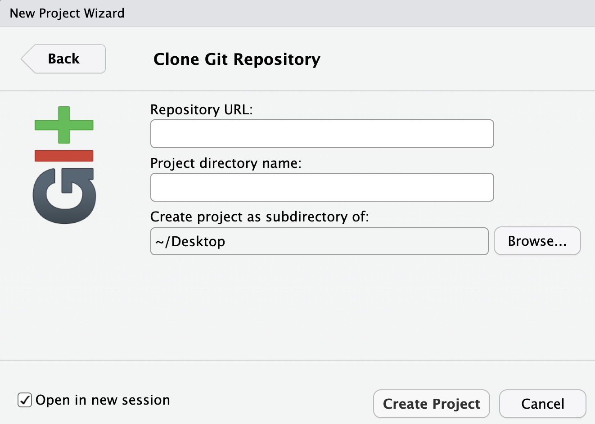
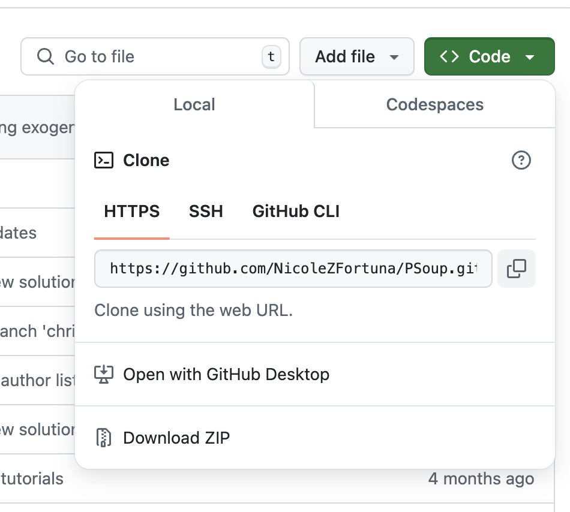

# GitHub
If you want to share your code with others, actively collaborate, or just want a back up of your code, you will benefit from having a GitHib account. GitHub can act as a remote repository which can either be private among a group of developers, or publicly available. 

Two important concepts when interacting with a remote repository like GitHub are to push and pull. When working on your code, you will always to this from within your local repository. To download code you do not have into your local repository, you 'pull' it from the remote. If you want to share code that you have written to the remote, you must 'push' it there. Once you have set up a connection between a local and remote repository, you interact with the remote primarily by pushing and pulling.

## Set up an account
 To create your own GitHub account use the following link: [Setting up your own GitHub account](https://docs.github.com/en/get-started/onboarding/getting-started-with-your-github-account).

Once you have your GitHub account, you will need to make sure that Git on your computer can communicate with GitHub. We can do this by using a HTTPS protocol, which will require a personal access token (PAT). 

To generate your token:
```{r, eval=FALSE}
usethis::create_github_token()
```

This will take you to a web page that will allow you generate the token. You should make a note of the purpose of the key (eg. what project it is used for), specify the expiry of the token (I recommend no expiry), and choose your scopes (use “repo”, “user”, and “workflow”). Click **Generate token**.

The generated token will not be accessible once you navigate from this page, so store it somewhere or keep the window open.

You can record your PAT using the following function:
```{r, eval=F}
gitcreds::gitcreds_set()
```


## Remote repositories

Once you have an account, on the repositories tab of your profile you can select to initiate a new repository. You will be required to name your project, and select if the repository is to be public or private. You can choose if you want to provide a description of your project, or if you want to automatically generate helper files like a README, .gitignore, or a license. If you are creating this remote repository for an already existing local repository you should NOT initiate a README, .gitignore, or choose a license. If you choose to initiate these files you will need to resolve merge conflicts when you try to push your local project to the remote repository.

Once you select **Create repository**, you will be taken to a page with instructions on how set up the repository depending on your particular situation. The commands are provided for you including the correct Git addresses, so you can copy the relevant commands directly into Terminal. If you are using Git Bash make sure that you are within the correct local directory. If you use the Terminal window within RStudio, you should automatically be in the correct directory.

For example, if you want to push a local repository on to your new remote, you can follow the instructions under the heading "…or push an existing repository from the command line", which will look something like the below:
```
git remote add origin https://github.com/JohnDoe/test.git
git branch -M main
git push -u origin main
```
Literally copy and past the commands into either Terminal or Git Bash. This will likely prompt an opportunity for you to provide your user name and PAT to validate your connection with GitHub.

From this point on, you can work directly with the Git tab on RStudio. To pull changes from the remote, select the downward blue arrow. Whenever you have an update to the package, commit the change and push the new version to your GitHub repository by selecting the upward green arrow.


### Automatically generating a remote repository

If Git on your computer has already been set up to interact with your GitHub account, you will be able to automatically generate a remote repository, and push your local reop to that remote using the `usethis` package.

Simply run:
```{r, eval=FALSE}
use_github()
```

The following checks will be performed: 

- that the project is already a Git repo
- that the current branch is the default branch
- that there are no uncommitted changes
- that there are no pre-existing origin remotes

If these checks pass, the following actions will be performed:

- An associated repository will be created on your GitHub
- That GitHub repository will be added to your local repository as the origin remote
- Make an initial push to GitHub
- Calls `use_github_links()` if the project is an R package, so as to add information to the DESCRIPTION file regarding the GitHub repository

### Clone repository

If there is an exisiting repository on GitHub that you would like to contribute to, you can clone that repository on to you computer so that you have your own local copy. To do so, open a **New Project**, select **Version Control**, then **Git**. You will need to provide the HTTPS link from the repository that you want to clone, and specify the location that you would like to keep the repository in. Check the **Open in new session box**, the select **Create Project**.

<center></center>

To find the HTTPS url link, click onto the GitHub page of your repository of interest. You will see a green **Code** drop down menu. Under **Local**, then **HTTPS**, you will see the url that you need to provide.

<center></center>

## Suggested workflow for multiple contributers
The proposed work flow is best practice for multiple users to minimize the chance that work is lost. All actions are performed within the user's local repository. A graphical representation of this work flow can be seen in Figure 3.

- On your local repository, build a new temporary branch that you will use to create a new feature. You will do work on this branch, and leave the main branch clean.
- Once you have completed work on your new feature, commit the changes.
- Switch back to the master branch and pull any changes that your collaborators may have made. This will allow you to merge any potential incompatibilities on your local machine.
- If there are merge conflicts, resolve them and commit the resolution. Once conflicts are resolved, or if there were no conflicts, you can push your changes to the remote.
- Once you have pushed your changes, you can delete the temporary branch.


