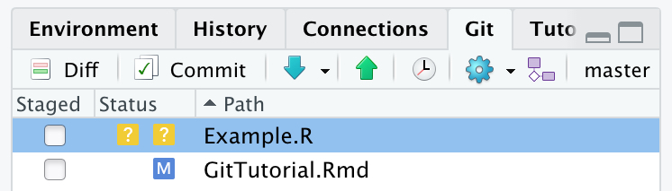

# GitHub


## Set up an account

## Remote repositories

If you want to share your package with other people, you will need to create a remote repository for your project on a host like GitHub. First you will need to create an account if you do not already have one. Click [here](https://docs.github.com/en/get-started/onboarding/getting-started-with-your-github-account) for instructions on how to do so.

Once you have an account, on the repositories tab of your profile you can select to initiate a new repository. You will be required to name your project, and select if the repository is to be public or private. You can choose if you want to provide a description of your project, or if you want to automatically generate helper files like a README, .gitignore, or a license. If you are creating this remote repository for an already existing local repository you should NOT initiate a README, .gitignore, or choose a license. If you choose to initiate these files you will need to resolve merge conflicts when you try to push your local project to the remote repository.

Once you select **Create repository**, you will be taken to a page with instructions on how set up the repository depending on your particular situation. The commands are provided for you including the correct Git addresses, so you can copy the relevant commands directly into terminal, making sure that you are within the correct local directory. If you use the terminal window within RStudio, you should automatically be in the correct directory.

For example, if you want to push a local repository on to your new remote, you can follow the instructions under the heading "…or push an existing repository from the command line", as bellow:
```
git remote add origin https://github.com/JohnDoe/test.git
git push -u origin main
```

From this point on, you can work directly with the Git tab on RStudio. Whenever you have an update to the package, commit the change and push the new version to your GitHub repository.

### Automatically generating a remote repository

If Git on your computer has already been set up to interact with your GitHub account, you will be able to automatically generate a remote repository, and push your package to that remote using the `usethis` package.

Simply run:
```{r, eval=FALSE}
use_github()
```

The following checks will be performed: 

- that the project is already a Git repo
- that the current branch is the default branch
- that there are no uncommitted changes
- that there are no pre-existing origin remotes

If these checks pass, the following actions will be performed:

- An associated repository will be created on your GitHub
- That GitHub repository will be added to your local repository as the origin remote
- Make an initial push to GitHub
- Calls `use_github_links()` if the project is an R package, so as to add information to the DESCRIPTION file regarding the GitHub repository

### Clone repository

## Suggested workflow for multiple contributers {-}
The proposed work flow is recommended for multiple users to minimize the chance that work is lost. All commands are still run within the directory of the user's local repository. A graphical representation of this work flow can be seen in Figure 3.

On your local repository, build a new temporary branch that you will use to create a new feature:
```{bash eval = FALSE}
git branch <feature>
```

Switch to that new branch:
```{bash eval = FALSE}
git checkout <feature>
```

Once you have completed work on your new feature, commit the changes:
```{bash eval = FALSE}
git add -A
git commit -m <"Built new feature.">
```

Switch back to the master branch and pull any changes that your collaborators may have made. This will allow you to merge any potential incompatibilities on your local machine.
```{bash eval = FALSE}
git pull origin master
git merge <feature>
```

If there are merge conflicts, resolve them and commit the resolution. Once conflicts are resolved, or if there were no conflicts, you can push your changes to the remote.
```{bash eval = FALSE}
git push origin master
```

Once you have pushed your changes, you can delete the temporary branch:
```{bash eval = FALSE}
git branch -d <feature>
```


## Using git in RStudio {-}

When developing a project in R, it is beneficial to organise any code or files associated with the project into an R project. This helps to keep your project organised, and also allows the user to take advantage of many of the features of RStudio. In relation to the usage of git, RStudio has it's own built in git user interface. In the top right hand corner of the RStudo IDE is the environment window. If git has been initiated for your project, you should see a git tab. This tab will allow you to perform almost all of the functions that you can perform through the terminal. In addition, in the Consol window, it is possible to open a Terminal tab that can allow you to interact with git as well. Depending on you comfort level and the complexity of what you want to achieve, you can use either of these methods to interact with git through your RStudio session. Personally, I prefer to use Terminal as the built in git features are slow to respond to switching between branches and registering file changes. Terminal instantaneously registers any change in the repository.

Git can be included when opening a new project, as you will be given an option to initiate git. If you have already established a project and want to add git version control, click on **Tools->Version Control->Project Setup...**. You will then be given the option to select the version control system that you want to use.

If you click on the Git tab within RStudio, you will be given a number of tools that will allow you to interact with git (Figure 4). Along the top panel of this tab are a number of buttons that can replace the most common git terminal commands. This tab will also list any files that do not match the previous commit. This could be because the file was modified, or because the file has been created since the last commit. These types of files will appear as listed in Figure 4. Newly added files will have a yellow question mark under the Status column, while a modified file will have a blue M listed on the right side of the column. It can be seen that under the Staged column, neither of the boxes have been ticked off. This means that neither of these files have been staged to be committed. If you would like to see the differenced in the listed files when compared to the most recent commit, you can select the Diff button. This will open up a window which will allow the user to explore the differences for each affected file. It is possible to stage files and commit them within this window. 

<center>
{width=50%}
</center>

<br>

In order to stage files, the user simply needs to tick the boxed listed in the staged column. As can be seen in Figure 5., once these files have been staged, their status will change. New files will be indicated with a green A, while the blue M for modified files will now be listed to the right. To commit the selected files the user needs to select the Commit button. This will open up a window that will allow the user the opportunity to provide a commit message.

In the top panel of the git tab, it is possible to pull from the remote repository (blue down button), and push to the remote repository (green up button). You can view the previous commit messages by clicking the clock. The blue gear button provides functionality to **Revert...** to previous commits, as well as to modify the **Ignore...** file. The button with purple shapes allows the user to create new branches, as well as add new remote repositories. Finally, you can see the name of the branch currently occupied. In the case of the provided example, this is the 'master' branch. If you click on the branch name, you will be able to switch between the branches that you have created.

<center>
{width=50%}
</center>

### Push and Pull

### Open Terminal in RStudio 

Terminal can be opened from within the RStudio IDE. It is opened next to the Console tab. If it is not already open you can open a new Terminal shell with the following keyboard short-cut: **Shift+Alt+T**. You can also open this window by clicking on **Tools->Terminal->New Terminal**. Once you have a Terminal shell open, you can use it as a regular Terminal window to initiate git and track changes in your project.


